# FerroBank - System & Workflow Flow Diagrams

Sequence diagrams for every demonstrable scenario. Render with any Mermaid
viewer (GitHub, VS Code + Mermaid extension, <https://mermaid.live>) - handy
for the report, slides, and the demo recording.

Actors used throughout: **User** (person), **Browser**, **Actix** (middleware +
handler), **Service** (business logic), **PostgreSQL**, **Telegram** (OTP and
notification delivery).

---

## 0. Tech stack - how the systems talk to each other

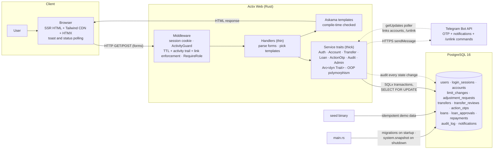

Request path in one line: **Browser → session middleware → ActivityGuard →
RequireRole → handler (thin) → service trait (thick) → SQLx transaction →
PostgreSQL → Askama template → HTML back.** Pages are fully server-side
rendered; the only JSON endpoints are the small polls (notifications, link
status, per-item status).

---

## 1. Registration & login

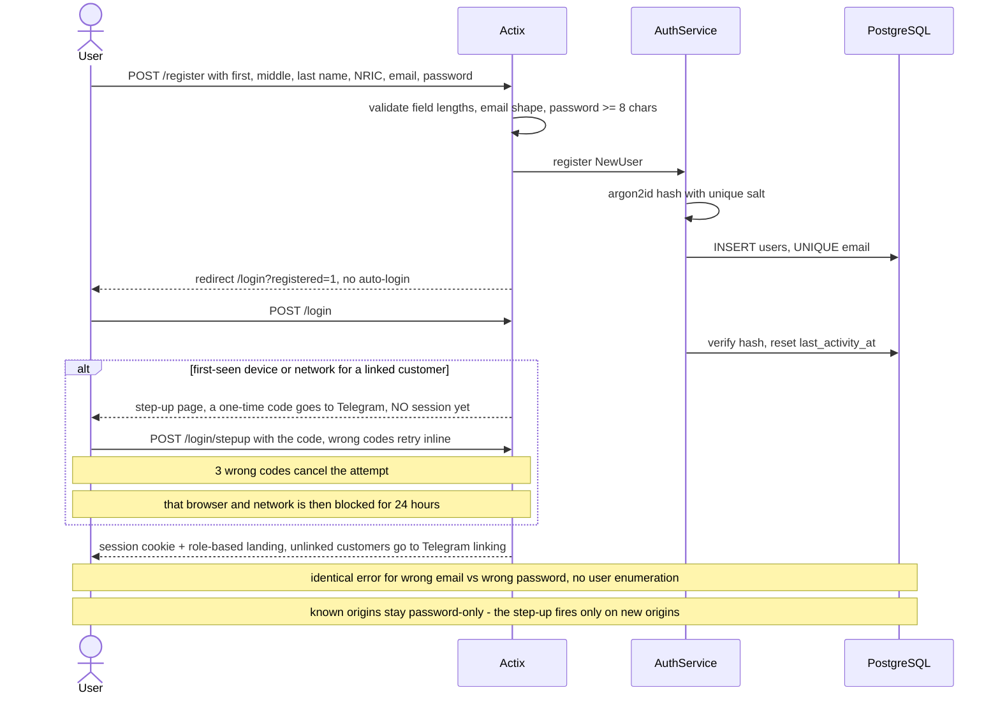

## 2. Account opening with OTP and maker-checker approval

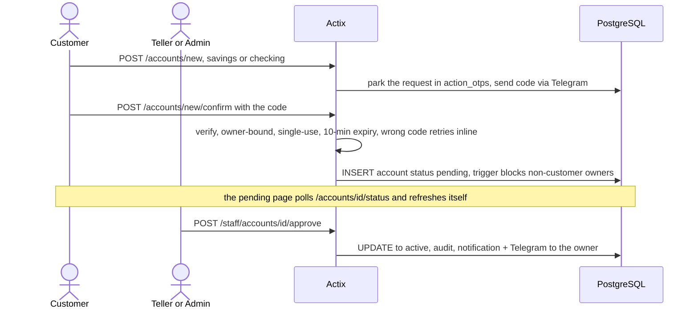

## 3. Money transfer - the core engine

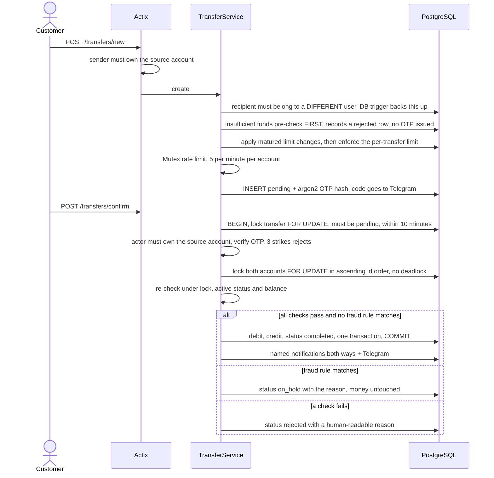

## 4. Concurrency - why simultaneous transfers cannot corrupt balances

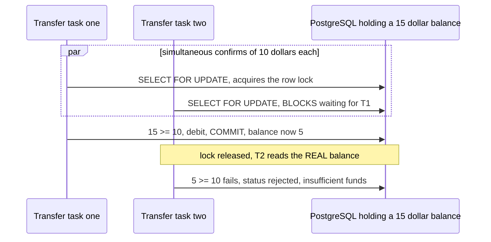

## 5. Fraud hold, identity review, hijack defense

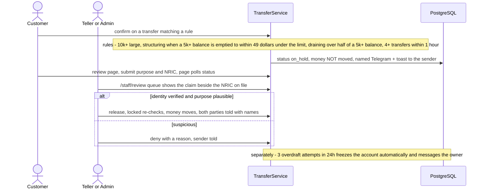

## 6. Transfer limit change with hold window

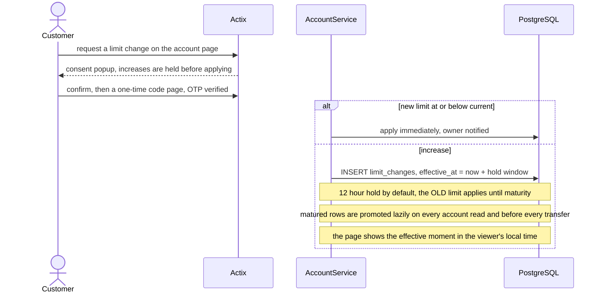

## 7. Loan lifecycle - dual approval, disbursement, due dates

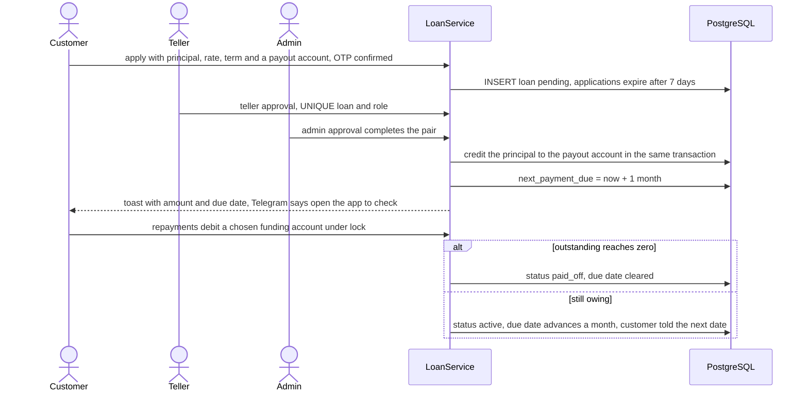

## 8. Dual-control balance adjustment

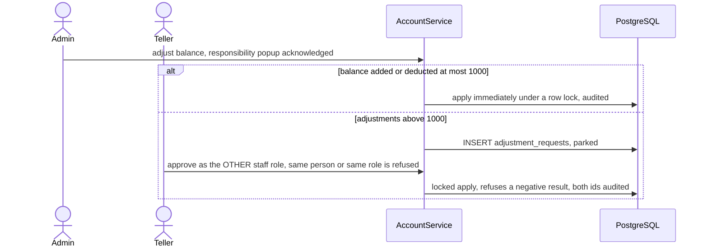

## 9. Profile changes and Telegram linking

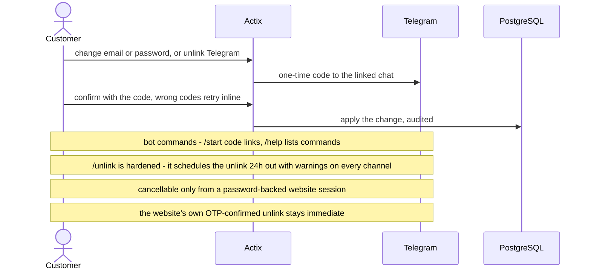

## 10. Sessions, TTLs, and the activity trail

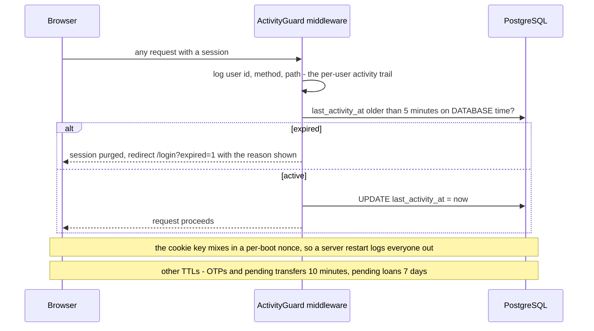

## 11. Notifications and live status

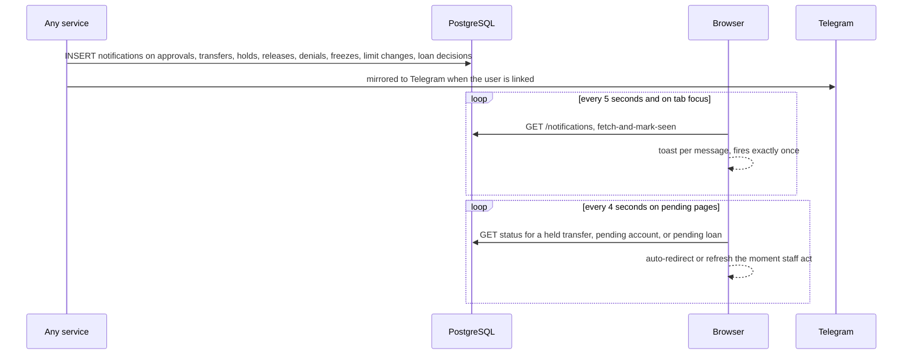

## 12. Graceful shutdown - system snapshot

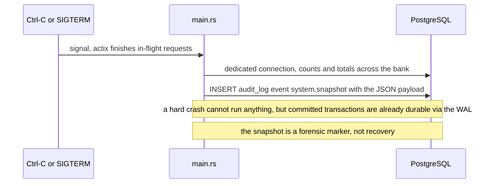

## 13. Login device tracking

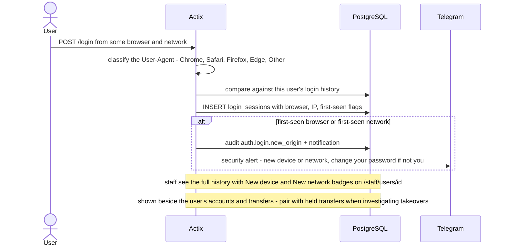
