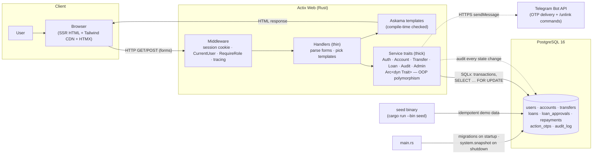
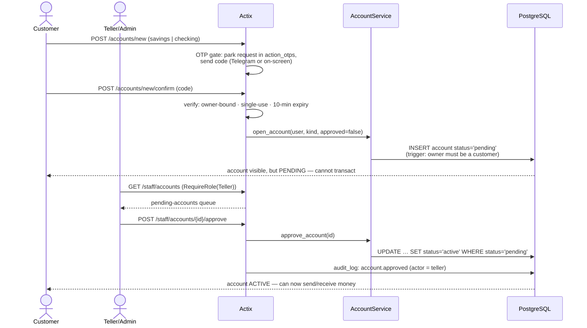
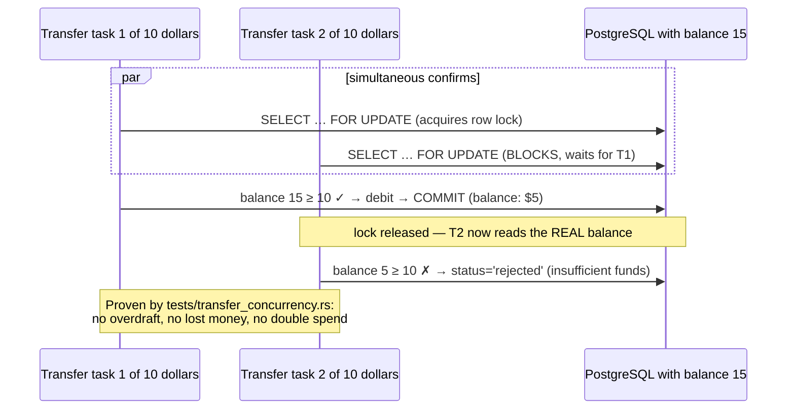
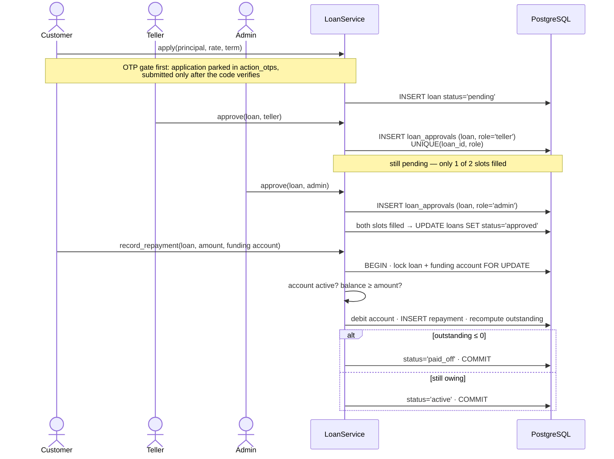
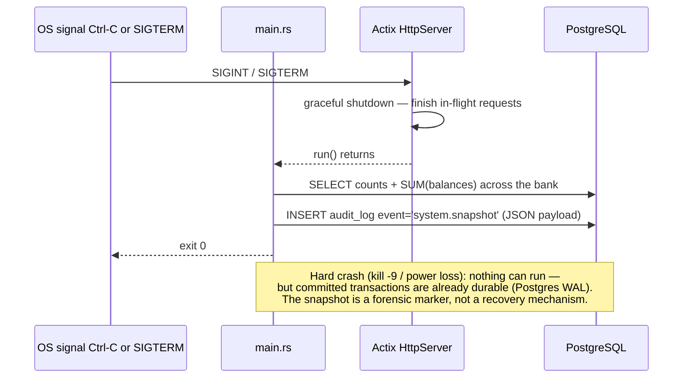
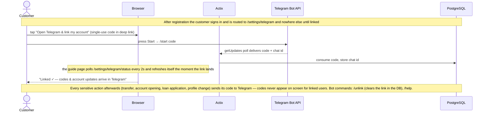
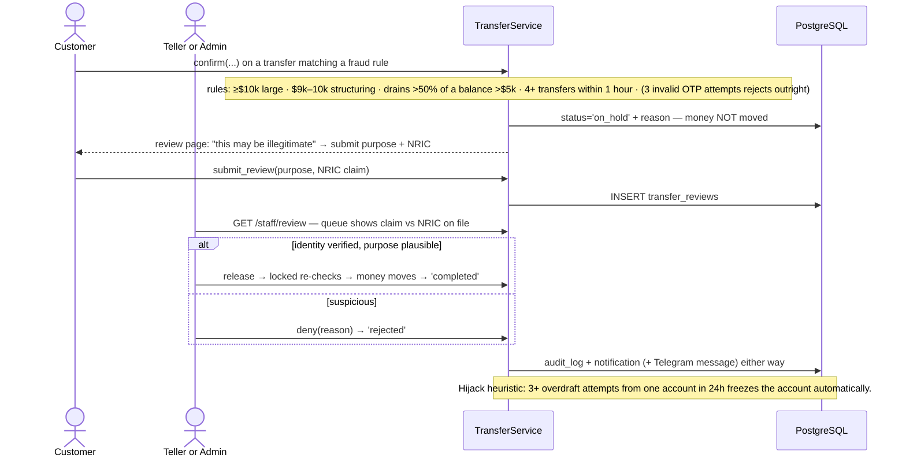
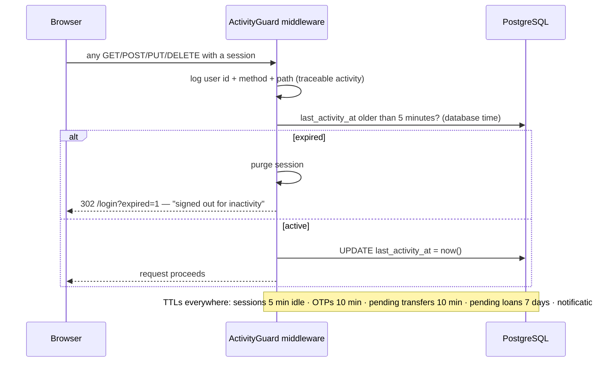
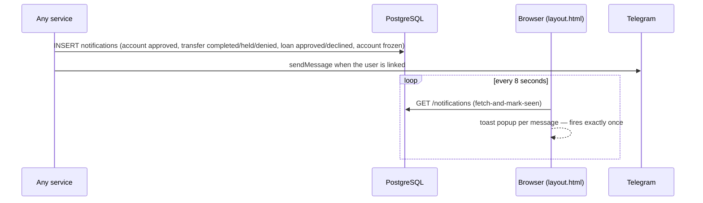

# FerroBank — System & Workflow Flow Diagrams

Sequence/flow diagrams for every demonstrable scenario, core workflows first,
then the security and verification features built on top of them.
Render with any Mermaid viewer (GitHub, VS Code + Mermaid extension,
<https://mermaid.live>) — handy for the report, slides, and the demo recording.

Actors used throughout: **User** (person), **Browser**, **Actix** (middleware +
handler), **Service** (business logic), **PostgreSQL**, plus **Telegram** for
the OTP/notification delivery channel.

---

## 0. Tech stack — how the systems talk to each other



Request path in one line: **Browser → session middleware → role guard →
handler → service trait → SQLx transaction → PostgreSQL → Askama template →
HTML back to the browser.** No JSON API, no client-side framework — every page
is server-side rendered; HTMX progressively enhances form posts.

---

## 1. Registration & login (sessions)


## 2. Account opening with maker–checker approval



## 3. Money transfer — two-step with OTP (core engine)

```mermaid
sequenceDiagram
    actor U as Customer
    participant B as Browser
    participant A as Actix transfers handler
    participant S as TransferService
    participant P as PostgreSQL

    U->>B: transfer form (from, to acct number, amount)
    B->>A: POST /transfers/new
    A->>A: parse Decimal · sender must OWN from-account
    A->>S: create(actor, from, to, amount)
    S->>P: recipient must belong to a DIFFERENT user<br/>(no self-transfers; DB trigger backs this up)
    S->>P: apply matured limit changes · enforce per-transfer limit
    S->>S: Mutex rate-limit (≤5/min per account)
    S->>S: generate 6-digit OTP → argon2 hash
    S->>P: INSERT transfer status='pending' + otp_hash
    S->>P: audit_log: transfer.created
    S-->>B: confirm page (code goes to Telegram — never on screen when linked)

    U->>B: types OTP
    B->>A: POST /transfers/confirm
    A->>S: confirm(actor, transfer_id, otp)
    S->>P: BEGIN
    S->>P: SELECT transfer FOR UPDATE (must be 'pending')
    S->>P: actor must own the source account (else Forbidden)
    S->>S: verify OTP against argon2 hash (3 strikes → rejected · 10-min TTL)
    S->>P: SELECT both accounts FOR UPDATE — ascending id (no deadlock)
    S->>S: re-check under lock: active? balance ≥ amount?
    alt all checks pass
        S->>P: debit · credit · status='completed' (one txn)
        S->>P: COMMIT
        S->>P: audit_log: transfer.completed
    else any check fails
        S->>P: status='rejected' + human-readable reason · COMMIT
        S->>P: audit_log: transfer.rejected
    end
    A-->>B: 302 → /transfers (history shows outcome + reason)
```

## 4. Concurrency: why simultaneous transfers can't corrupt balances



## 5. Loan lifecycle — dual approval (four-eyes) + repayment



## 6. Graceful shutdown — system snapshot to the audit log



---

# Security & verification features

## 7. OTP delivery via Telegram (mandatory for customers)



## 8. Fraud hold + staff review (NRIC identity check)



## 9. Transfer limit change with hold window

```mermaid
sequenceDiagram
    actor U as Customer
    participant B as Browser
    participant S as AccountService
    participant P as PostgreSQL

    U->>B: account page → request limit change
    B->>U: consent popup: increases are risky → held before applying
    U->>B: confirm
    alt new limit ≤ current
        S->>P: apply immediately (lowering reduces risk)
    else increase
        S->>P: INSERT limit_changes, effective_at = now() + hold window
        Note over S,P: 12h default · Alice's accounts seeded to 10s for the demo. The OLD limit applies until maturity; the transfer engine promotes matured rows lazily before enforcing.
    end
```

## 10. Inactivity TTL + activity trail (every request)



## 11. Notifications (browser toasts + Telegram)


