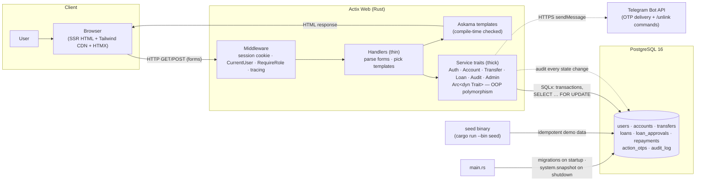
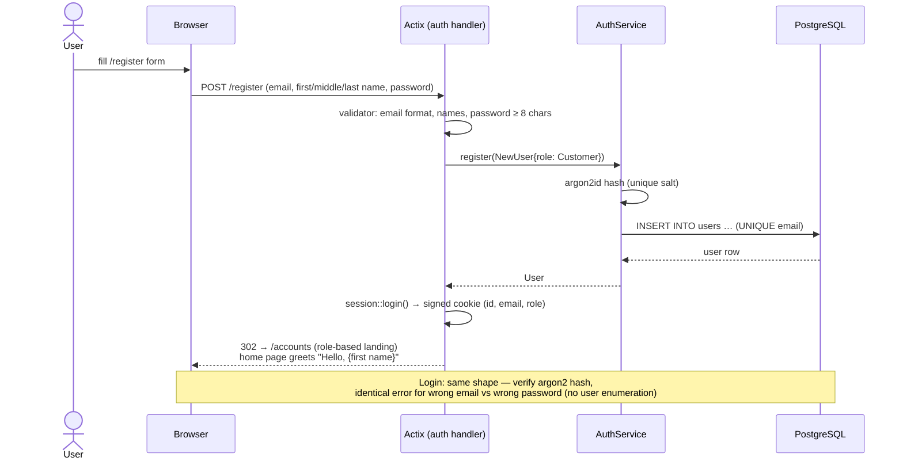
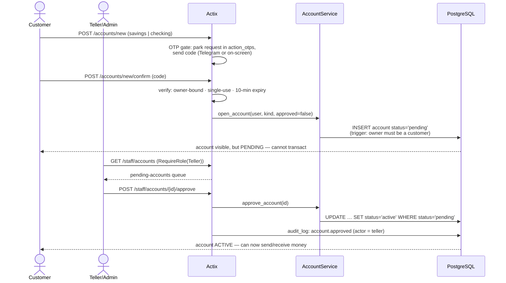
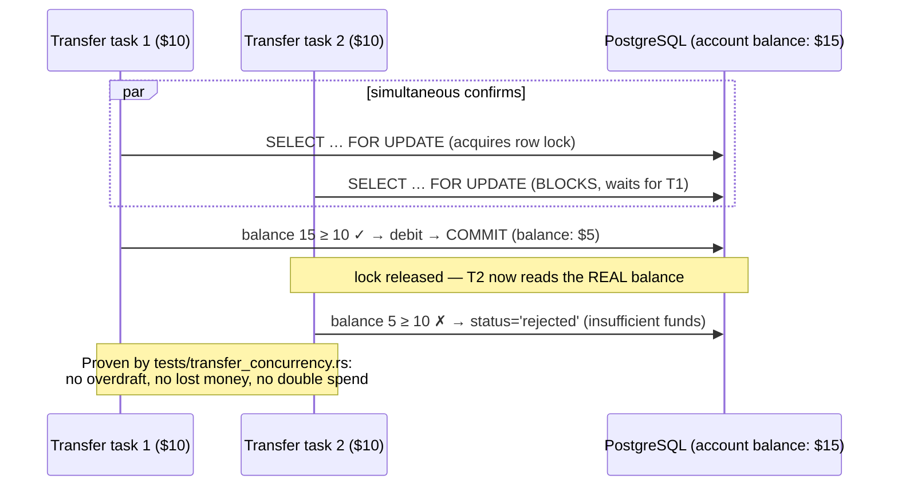
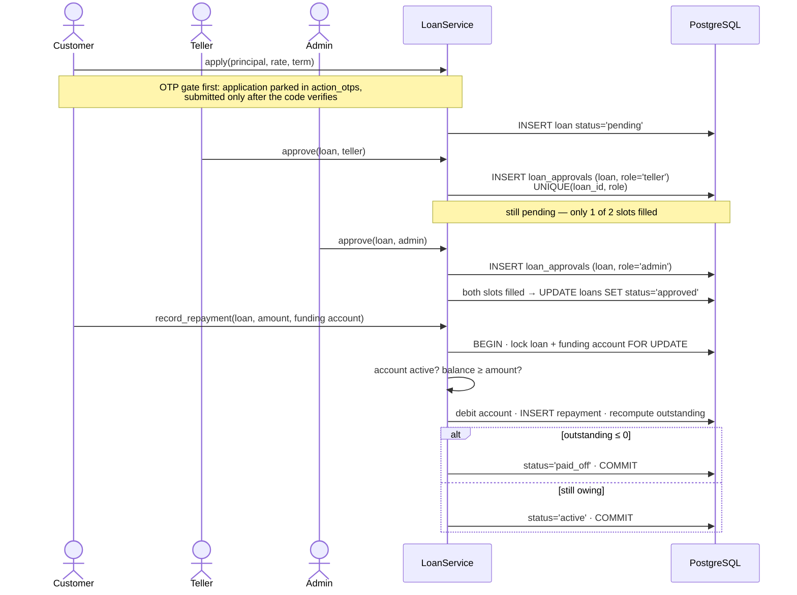
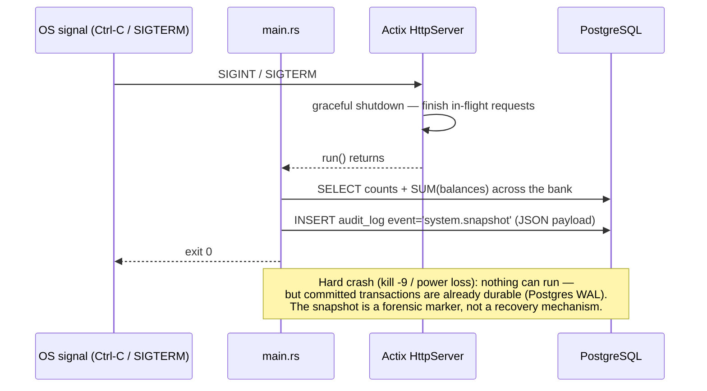
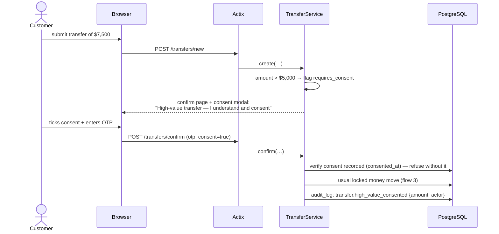
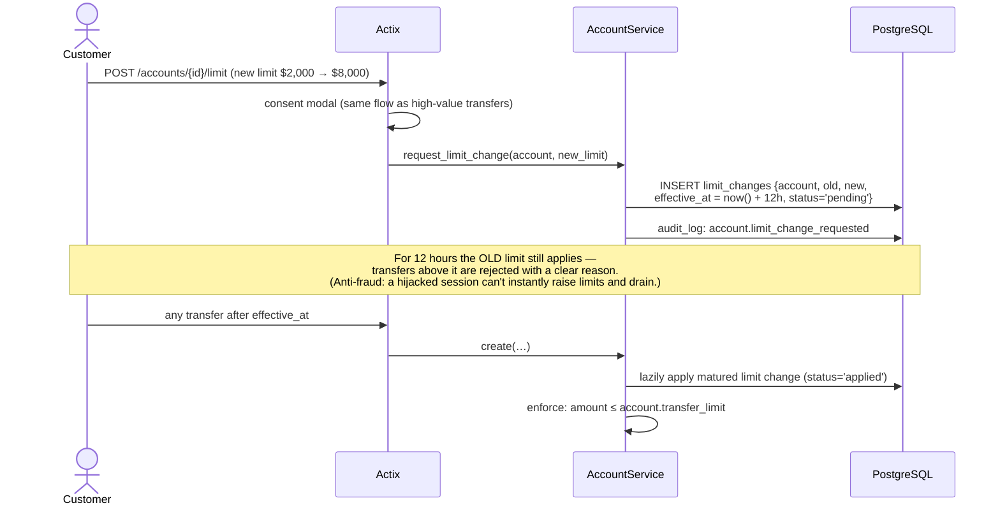

# FerroBank — System & Workflow Flow Diagrams

Sequence/flow diagrams for every demonstrable scenario: the implemented core
workflows first, then the **planned additional features** (marked *PLANNED*).
Render with any Mermaid viewer (GitHub, VS Code + Mermaid extension,
<https://mermaid.live>) — handy for the report, slides, and the demo recording.

Actors used throughout: **User** (person), **Browser**, **Actix** (middleware +
handler), **Service** (business logic), **PostgreSQL**, plus **Telegram** for
the OTP delivery channel.

---

## 0. Tech stack — how the systems talk to each other



Request path in one line: **Browser → session middleware → role guard →
handler → service trait → SQLx transaction → PostgreSQL → Askama template →
HTML back to the browser.** No JSON API, no client-side framework — every page
is server-side rendered; HTMX progressively enhances form posts.

---

## 1. Registration & login (sessions)



## 2. Account opening with maker–checker approval



## 3. Money transfer — two-step with OTP (core engine)

```mermaid
sequenceDiagram
    actor U as Customer
    participant B as Browser
    participant A as Actix (transfers handler)
    participant S as TransferService
    participant P as PostgreSQL

    U->>B: transfer form (from, to acct number, amount)
    B->>A: POST /transfers/new
    A->>A: parse Decimal · sender must OWN from-account
    A->>S: create(actor, from, to, amount)
    S->>P: recipient must belong to a DIFFERENT user<br/>(no self-transfers; DB trigger backs this up)
    S->>S: Mutex rate-limit (≤5/min per account)
    S->>S: generate 6-digit OTP → argon2 hash
    S->>P: INSERT transfer status='pending' + otp_hash
    S->>P: audit_log: transfer.created
    S-->>B: confirm page (recipient name + demo OTP)

    U->>B: types OTP
    B->>A: POST /transfers/confirm
    A->>S: confirm(actor, transfer_id, otp)
    S->>P: BEGIN
    S->>P: SELECT transfer FOR UPDATE (must be 'pending')
    S->>P: actor must own the source account (else Forbidden)
    S->>S: verify OTP against argon2 hash
    S->>P: SELECT both accounts FOR UPDATE — ascending id (no deadlock)
    S->>S: re-check under lock: active? balance ≥ amount?
    alt all checks pass
        S->>P: debit · credit · status='completed' (one txn)
        S->>P: COMMIT
        S->>P: audit_log: transfer.completed
    else any check fails
        S->>P: status='rejected' + human-readable reason · COMMIT
        S->>P: audit_log: transfer.rejected
    end
    A-->>B: 302 → /transfers (history shows outcome + reason)
```

## 4. Concurrency: why simultaneous transfers can't corrupt balances



## 5. Loan lifecycle — dual approval (four-eyes) + repayment



## 6. Graceful shutdown — system snapshot to the audit log



---

# Planned additional features

## 7. OTP delivery via Telegram bot (IMPLEMENTED)

```mermaid
sequenceDiagram
    actor U as Customer
    participant B as Browser
    participant A as Actix
    participant S as TransferService
    participant TG as Telegram Bot API
    participant P as PostgreSQL

    Note over U,P: One-time linking
    U->>B: profile page → "Link Telegram" deep link<br/>https://t.me/FerroBankBot?start=&lt;one-time code&gt;
    U->>TG: taps Start (sends /start &lt;code&gt;)
    TG-->>A: getUpdates poll: /start &lt;code&gt; + chat_id
    A->>P: match code → save chat_id (+ phone) on user

    Note over U,P: Every transfer afterwards
    U->>A: POST /transfers/new
    A->>S: create(…) → OTP generated, argon2-hashed in DB
    S->>TG: POST /bot&lt;TOKEN&gt;/sendMessage {chat_id, "Your FerroBank code: 123456"}
    TG-->>U: OTP arrives in the user's Telegram
    U->>A: POST /transfers/confirm (types code from phone)
    A->>S: confirm(…) — unchanged from flow 3
    Note over S: Users without a linked chat_id fall back to<br/>the on-screen demo OTP (current behaviour)
```

## 8. PLANNED — High-value transfer consent (> $5,000)



## 9. PLANNED — Per-account transfer limit with 12-hour hold



## 10. PLANNED — Flagged-transfer hold + staff intervention

```mermaid
sequenceDiagram
    actor U as Customer
    actor ST as Teller/Admin
    participant S as TransferService
    participant P as PostgreSQL

    U->>S: confirm(…) on a transfer matching a fraud rule<br/>(≥ $10k · $9k–10k structuring · 4+ in 24h velocity)
    S->>P: instead of completing: status='on_hold' + reason<br/>(money NOT moved; nothing debited yet)
    S->>P: audit_log: transfer.held {rule}
    S-->>U: "Transfer held for review" page

    ST->>S: GET /staff/review (held-transfer queue)
    alt staff approves
        ST->>S: POST /staff/transfers/{id}/release
        S->>P: locked money move (flow 3) → status='completed'
        S->>P: audit_log: transfer.released {reviewer}
    else staff rejects
        ST->>S: POST /staff/transfers/{id}/deny
        S->>P: status='rejected' + reviewer's reason
        S->>P: audit_log: transfer.denied {reviewer}
    end
    Note over ST,P: Every decision is attributable: the audit row records<br/>WHO released/denied WHAT and WHY — the compliance story.
```
